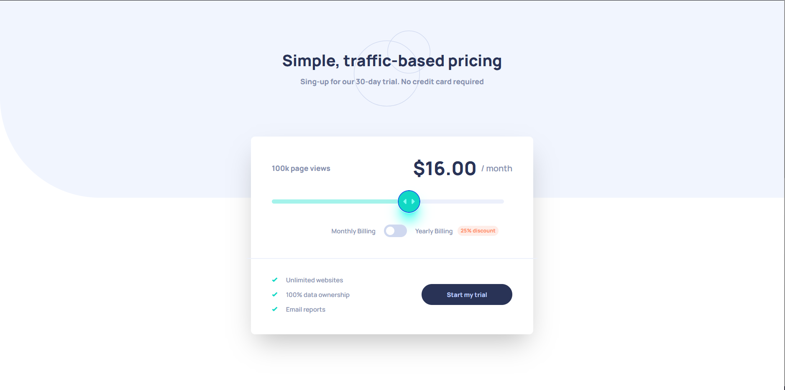
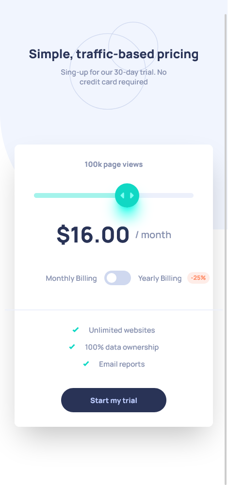
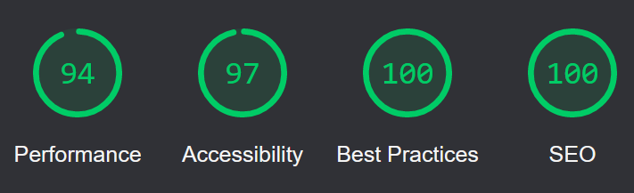

<div align="center" id="top"> 
  


  <a href="https://joaopmazzo.github.io/interactive-pricing-component/">Demo</a>
  

  
</div>

<h1 align="center">Interactive Pricing Component</h1>

<p align="center">
  

  

  

  

  <!--  -->

  <!--  -->

  <!--  -->
</p>

<!-- Status -->

<!-- <h4 align="center"> 
	🚧  Interactive Pricing Component 🚀 Under construction...  🚧
</h4> 

<hr> -->

<p align="center">
  <a href="#dart-about">About</a> &#xa0; | &#xa0; 
  <a href="#sparkles-features">Features</a> &#xa0; | &#xa0;
  <a href="#rocket-technologies">Technologies</a> &#xa0; | &#xa0;
  <a href="#white_check_mark-requirements">Requirements</a> &#xa0; | &#xa0;
  <a href="#checkered_flag-starting">Starting</a> &#xa0; | &#xa0;
  <a href="#memo-license">License</a> &#xa0; | &#xa0;
  <a href="https://github.com/{{YOUR_GITHUB_USERNAME}}" target="_blank">Author</a>
</p>

<br>

## :dart: About ##

This project was created as the solution for [interactive-pricing-component](https://www.frontendmentor.io/challenges/interactive-pricing-component-t0m8PIyY8/hub/responsive-and-interactive-rating-component-PaLGhnSDDe) challenge on the [frontendmentor](https://www.frontendmentor.io/home) website.

Desktop preview:

  

Mobile preview:

  

## :sparkles: Features ##

:heavy_check_mark: React Hooks;\
:heavy_check_mark: Radix accessible components library;\
:heavy_check_mark: Mobile first;\
:heavy_check_mark: Responsive;

## :rocket: Technologies ##

The following tools were used in this project:

- [React](https://pt-br.reactjs.org/)
- [TypeScript](https://www.typescriptlang.org/)
- [Radix-ui](https://www.radix-ui.com/)
- [Github-pages](https://pages.github.com/)

## :traffic_light: Page quality measurement ##



Checked with [web.dev](https://web.dev/measure/)

## :white_check_mark: Requirements ##

Before starting :checkered_flag:, you need to have [Git](https://git-scm.com) and [Node](https://nodejs.org/en/) installed.

## :checkered_flag: Starting ##

```bash
# Clone this project
$ git clone https://github.com/{{YOUR_GITHUB_USERNAME}}/interactive-pricing-component

# Access
$ cd interactive-pricing-component

# Install dependencies
$ yarn

# Run the project
$ yarn dev

# The server will initialize in the <http://localhost:3000>
```

## :memo: License ##

This project is under license from MIT. For more details, see the [LICENSE](LICENSE.md) file.


Made with :heart: by <a href="https://github.com/joaopmazzo" target="_blank">João Paulo Mazzo</a>

&#xa0;

<a href="#top">Back to top</a>
